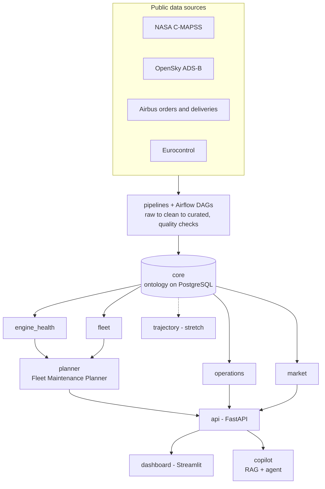

# AeroLisa: A Skywise-inspired Aviation AI & Data Platform

> AeroLisa is an independent, Skywise-inspired aviation AI and data platform that brings predictive maintenance, fleet utilization, operational performance, and market analytics together on a single shared ontology, paired with a decision dashboard and an AI copilot to turn aviation data into actionable insight. It is a personal learning project built entirely on public data, and it is not affiliated with, endorsed by, or connected to Airbus or Skywise.

---

## Why AeroLisa ?

Airline fleets produce enormous amounts of engine, flight and operational data. Platforms such as Skywise turn that data into decisions: which engine to inspect first, which aircraft is flown hardest, where delays come from, how production shapes tomorrow's fleet. AeroLisa rebuilds that idea at small scale, with real engineering practices: ingestion pipelines, a shared data model, machine-learning modules, an API, a dashboard, an LLM copilot, tests, CI/CD, containers and cloud deployment.

## ⭐ Flagship: the Fleet Maintenance Planner

NASA C-MAPSS engines are assigned to real A320-family airframes tracked on the OpenSky Network. Each engine's degradation advances with its aircraft's **real flight cycles**. The planner combines predicted remaining useful life, anomaly scores and utilization into a **ranked, explained list of engines to inspect first**. The fleet is **simulated** (C-MAPSS engines are synthetic) and labelled as such everywhere. The flight activity driving it is real.

## Architecture



Design principles, detailed in [docs/architecture.md](docs/architecture.md):

1. **Ontology first.** Every module reads and writes real-world objects (Aircraft, Engine, Flight…) defined once in `aerolisa.core`.
2. **Modules are independent.** They import only `aerolisa.core`, never each other. Only the planner, API, dashboard and copilot combine them.
3. **Everything runs offline** on `sample_data/`; real data is downloaded at runtime and never committed.

## What's inside

| Component | Path | Plan | Target | Status |
|---|---|---|---|---|
| Core: ontology & shared library | `src/aerolisa/core` | — | v0.1 · Jan 2027 | planned |
| CLI | `src/aerolisa/cli` | Mini-project #0 | v0.1 · Nov 2026 | planned |
| ETL pipelines | `src/aerolisa/pipelines + dags/` | Project #1 | v0.1 · Jan 2027 | planned |
| Market analytics | `src/aerolisa/modules/market` | — | v0.1 · Jan 2027 | planned |
| Engine health (RUL + anomalies) | `src/aerolisa/modules/engine_health` | Project #2 | v0.2 · Mar 2027 | planned |
| Fleet utilization | `src/aerolisa/modules/fleet` | — | v0.3 · Apr 2027 | planned |
| Operations performance | `src/aerolisa/modules/operations` | — | v0.3 · Apr 2027 | planned |
| Fleet Maintenance Planner ⭐ | `src/aerolisa/planner` | Flagship | v0.3 · Apr 2027 | planned |
| Ontology API | `src/aerolisa/api` | — | v0.3 · Apr 2027 | planned |
| Dashboard | `dashboard/` | — | v0.1 → v1.0 | planned |
| Copilot (RAG + agent) | `src/aerolisa/copilot` | Project #3 | v1.0 · May 2027 | planned |
| Trajectory optimization | `src/aerolisa/modules/trajectory` | Stretch | Summer 2027 | planned |

Each component has its own README with its goal, features, data and definition of done.

## Tech stack

**Data engineering:** Python, pandas, PostgreSQL, Apache Airflow, PySpark, BigQuery
**Machine learning:** scikit-learn, XGBoost, PyTorch, MLflow
**Generative AI:** LangChain or LlamaIndex, Chroma / FAISS, an LLM API
**Apps & APIs:** FastAPI, Streamlit, Plotly
**Engineering:** Docker Compose, GitHub Actions, pytest, Ruff, pre-commit, Google Cloud (Cloud Run, Vertex AI)

## Repository structure

```text
aerolisa/
├── .github/
│   ├── workflows/ci.yml          # lint + tests on every push
│   ├── ISSUE_TEMPLATE/           # feature, bug, module task
│   └── pull_request_template.md
├── dags/                         # Airflow DAGs, one per data source
├── dashboard/                    # Streamlit multipage app
├── docs/
│   ├── architecture.md
│   ├── ontology.md
│   ├── data-sources.md
│   └── adr/                      # architecture decision records
├── infra/                        # Dockerfiles, cloud config
├── notebooks/                    # exploration only, never imported
├── reports/                      # evaluation and data-quality reports
├── sample_data/                  # tiny samples so everything runs offline
├── src/aerolisa/
│   ├── core/                     # ontology, database, config
│   ├── cli/                      # command-line tool
│   ├── pipelines/                # extract, transform, load, quality
│   ├── modules/
│   │   ├── market/
│   │   ├── engine_health/
│   │   ├── fleet/
│   │   ├── operations/
│   │   └── trajectory/
│   ├── planner/                  # Fleet Maintenance Planner
│   ├── api/                      # FastAPI ontology access layer
│   └── copilot/                  # RAG + agent
├── tests/
├── docker-compose.yml
├── Makefile
├── pyproject.toml
├── CHANGELOG.md
├── CONTRIBUTING.md
├── ROADMAP.md
├── SECURITY.md
└── LICENSE
```

## Quick start

> 🚧 Early development. Commands will grow with each release; see [CHANGELOG.md](CHANGELOG.md).

```bash
git clone https://github.com/xdmanflow/aerolisa.git
cd aerolisa
python -m venv .venv && source .venv/bin/activate
make install          # installs AeroLisa with dev tools
make test             # runs the test suite
cp .env.example .env  # local settings; never commit .env
make up               # starts PostgreSQL (more services added per release)
```

## Data sources

| Source | Used for | Terms |
|---|---|---|
| NASA C-MAPSS turbofan degradation simulation | Engine health, planner | Public NASA dataset; downloaded at runtime |
| OpenSky Network ADS-B | Fleet utilization, planner, trajectory | OpenSky terms of use (non-commercial research); raw data not redistributed |
| Airbus orders & deliveries | Market analytics | Public figures from airbus.com; not redistributed |
| Eurocontrol performance data | Operations | ansperformance.eu terms |
| Public maintenance documents | Copilot corpus | Each source listed with its licence |

Details in [docs/data-sources.md](docs/data-sources.md).

## Roadmap

| Release | Target | Scope |
|---|---|---|
| v0.1 | Jan. 17, 2027 | Core ontology, ETL pipelines, market analytics, first dashboard |
| v0.2 | Mar. 7, 2027 | Engine health: RUL prediction + anomaly detection |
| v0.3 | Apr. 18, 2027 | Fleet + operations, planner v0, FastAPI, deployed on Google Cloud |
| v1.0 | May 16, 2027 | Copilot, demo video |
| Stretch | Summer 2027 | Trajectory optimization |

Full roadmap: [ROADMAP.md](ROADMAP.md).

## Results

_Metrics, screenshots and the demo video will be added at each release. No result is claimed before it is measured._

## Learning companion

AeroLisa is the applied side of **[Renaissance Project](https://github.com/xdmanflow/renaissance-project)**, my public one-year learning plan in mathematics, computer science, data and AI. What I learn each weekend there is applied here.

## Author

**Manil DOUDOU**, engineering student in computer science (AI & data science).
## License

Code under the [MIT License](LICENSE). Data remains under its original owners' terms.
