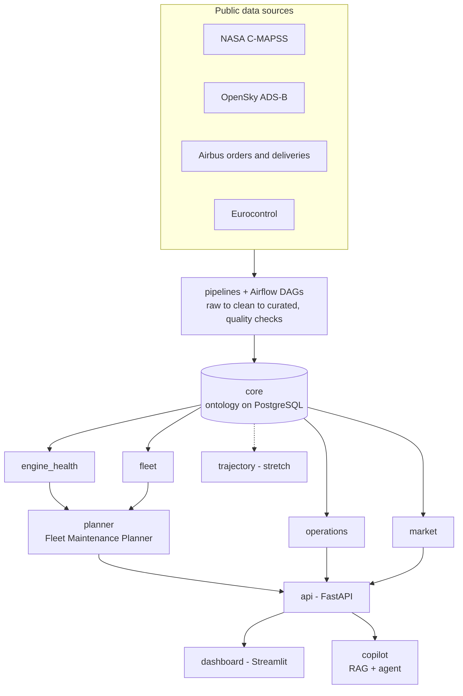

# Architecture



## Layers
1. **Sources**: public datasets, downloaded at runtime.
2. **Pipelines** (`aerolisa.pipelines`, `dags/`): raw → clean → curated, idempotent tasks, a data-quality report per run.
3. **Ontology** (`aerolisa.core`): real-world objects and their links, stored in PostgreSQL. See [ontology.md](ontology.md).
4. **Modules** (`aerolisa.modules.*`): independent analytics, each reading and writing ontology objects.
5. **Applications**: planner, API, dashboard, copilot.
6. **Platform**: Docker Compose, CI/CD, MLflow, Google Cloud.

## Dependency rule
```text
core  ←  pipelines, modules  ←  planner, api  ←  dashboard, copilot
```
Arrows point to what a component may import. Anything else is a design error.

## Decisions
See [adr/](adr).
