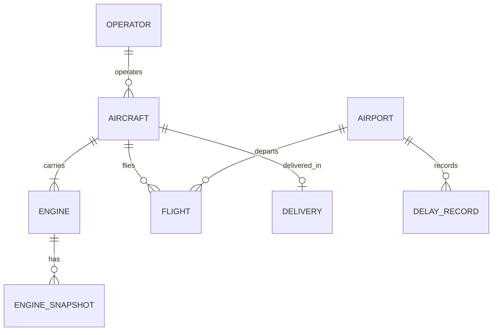

# Ontology (draft v0)

> Draft to be refined on Dec. 19–20, 2026 after studying Foundry ontology concepts. Attributes are a starting point, not final.

| Object | Key attributes | Filled by |
|---|---|---|
| Aircraft | icao24, registration, type, family, operator | pipelines (OpenSky) |
| Engine | engine_id, aircraft, position, cycles_since_new, simulated | planner (C-MAPSS assignment) |
| EngineSnapshot | engine, timestamp, predicted_rul, anomaly_score, model_version | engine_health |
| Flight | aircraft, departure, arrival, takeoff_time, landing_time, block_time | fleet |
| Airport | icao, iata, name, latitude, longitude | pipelines |
| Operator | icao, name, country | pipelines |
| Delivery | month, family, customer_region, count | market |
| DelayRecord | airport, date, cause, minutes | operations |
